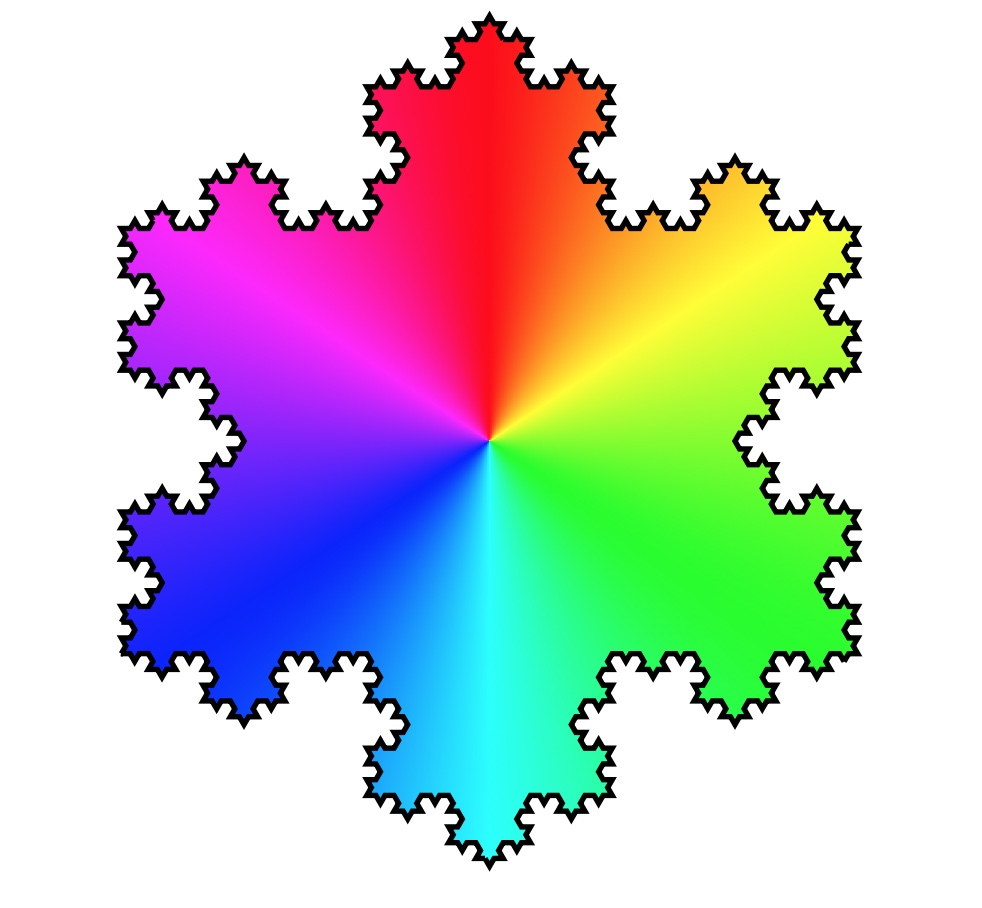

<html lang="en">
<head>
    <meta charset="UTF-8">
    <meta name="viewport" content="width=device-width, initial-scale=1.0">
    <title>Curriculum Vitae</title>
    
</head>
<body>
    

        <header>
            <h1>Curriculum Vitae</h1>
            

                
                

                    
<strong>Kevin Silva-Pérez</strong>

                    
+1 7874877696

                    
<a href="mailto:kevin.silva1@upr.edu">kevin.silva1@upr.edu</a>

                    
<a href="https://www.researchgate.net/profile/Kevin-Silva-Perez">ResearchGate/KevinSilva</a>

                    
<a href="https://github.com/kevinsilvamat/CV-Kevin-Silva-Perez">Github - CV</a>

                

            

        </header>

    
        
    <section class="education">
            <h2>Education</h2>
            <table>
                <tr>
                    <th>Degree/Certificate</th>
                    <th>Institute/Board</th>
                    <th>CGPA</th>
                    <th>Year</th>
                </tr>
                <tr>
                    <td>PhD in Computational and Statistics Mathematics</td>
                    <td>University of Puerto Rico at Río Piedras</td>
                    <td>4.0</td>
                    <td>2023</td>
                </tr>
                <tr>
                    <td>MSc. in Applied Mathematics</td>
                    <td>University of Puerto Rico at Mayagüez</td>
                    <td>3.7</td>
                    <td>2021</td>
                </tr>
                <tr>
                    <td>Bachelor of Mathematics</td>
                    <td>Universidad de Cartagena</td>
                    <td>3.6</td>
                    <td>2020</td>
                </tr>
            </table>
            
<strong>(*):</strong> Advisor: Alejandro Vélez-Santiago, PhD

            
<strong>Dissertation:</strong> Diffusion over Domains with Ramified Fractal Boundaries

        </section>

        <section class="work-experience">
    <h2>Work Experience</h2>
    <ul>
        <li>
            <strong>Teaching Assistant (TA)</strong> 
            <em>University of Puerto Rico at Rio Piedras</em> 
            <em>Professor (MATE 3105)</em> 
            <em>Aug 2023 - Present</em>
        </li>
        <li>
            <strong>Teaching Assistant (TA)</strong> 
            <em>University of Puerto Rico at Mayaguez</em> 
            <em>Professor of Pre Calculus I, Pre Calculus II and Calculus</em> 
            <em>Aug 2021 - May 2023</em>
        </li>
        <li>
            <strong>College Board and SAT</strong> 
            <em>University of Puerto Rico at Mayaguez</em> 
            <em>Professor in Mathematical Reasoning</em> 
            <em>Sep 2021 - Dec 2022</em>
        </li>
        <li>
            <strong>Tutor</strong> 
            <em>Universidad de Cartagena, Colombia</em> 
            <em>Tutor in Calculus I, II and III, Differential Equations and Statistics.</em> 
            <em>Aug 2019 - May 2021</em>
        </li>
    </ul>
        </section>

       <section class="my-research">
    <h2>My Research</h2>
    

        
    

    

        

            My research focuses on partial differential equations on domains with fractal boundaries. I also employ functional analysis and classical analysis, semigroup theory, and control theory. I apply these concepts to heat and diffusion problems in biological processes, and I am currently delving into machine learning with PDEs.
        

    

</section>

        <section class="publications-research-papers">
            <h2>Publications: Research Papers</h2>
            <ul>
                <li>
                    <strong>K. Silva-Pérez*, A. Vélez-Santiago</strong> 
                    <em>Diffusion over ramified domains: solvability and fine regularity.</em> 
                    <em>Submitted to Calculus of Variation and PDEs (Germany).</em> 
                    <em>Dec. 2023</em>
                </li>
                <!-- Agregar más elementos de la lista según sea necesario -->
            </ul>
        </section>

        <section class="publications-books">
    <h2>Publications: Books</h2>
    <ul>
        <li>
            <strong>K. Silva-Pérez, R. Arrieta-Montalvo, P. Ortega, B. Johnson</strong>
             
            <em>Calculus with MATLAB.</em>
             
            Published by Editorial Universidad de Cartagena.
             
            April, 2021
        </li>
        <!-- Añade aquí más publicaciones de libros -->
    </ul>
</section>

<section class="talks-at-math-conferences">
    <h2>Talks at Math Conferences</h2>
    <ul>
        <li>
            <strong><a href="https://conferences.cirm-math.fr/2950.html">Analysis on Fractals and Networks, and Applications</a></strong>
             
            Diffusion on Bronchial Trees: Construction and Approximation Results (Poster Presentation)
             
            18 - 22 March, 2024
             
            CIRM, France
        </li>
        <li>
            <strong><a href="https://www.uprh.edu/uprh-sede-de-seminario-interuniversitario-de-investigacion-en-ciencias-matematicas/">XXXIX Interuniversity Seminar on Research in the Mathematical Sciences (SIDIM)</a></strong>
             
            Date: 1 - 2 March, 2024
             
            Location: Humacao, PR
        </li>
        <li>
            <strong>Charla, Café y Ciencia</strong>
             
            Talk: Hausdorff Measure over Domains with Ramified Fractal Boundaries
             
            Date: 20 June, 2023
             
            Location: Universidad de Cartagena, Colombia
        </li>
        <li>
            <strong><a href="http://aimsconference.org/conferences/2023/program-compressed-2023-05-22-0855.pdf">The 13th AIMS Conference on Dynamical Systems, Differential Equations And Applications</a></strong>
             
            Talk: Diffusion over Bronchial Trees: Fine Regularity (with Dr. Alejandro Vélez-Santiago)
             
            Date: May 31 – June 4, 2023
             
            Location: Wilmington, NC USA
        </li>
        <li>
            <strong><a href="https://www.uprm.edu/math/sidimxxxviii/#1668520982779-b179a3f8-e2e5">XXXVIII Interuniversity Seminar on Research in the Mathematical Sciences (SIDIM)</a></strong>
             
            Talk: Diffusion on Bronchial Trees
             
            Date: 24 - 25 February, 2023
             
            Location: Mayaguez, PR
        </li>
        <li>
            <strong><a href="https://www.ipam.ucla.edu/programs/special-events-and-conferences/latinx-in-the-mathematical-sciences-conference-2022/">Latinx in the Mathematical Sciences Conference</a></strong>
             
            Date: 7 - 9 July, 2022
             
            Location: UCLA campus, California, USA
        </li>
        <li>
            <strong><a href="https://math.cornell.edu/7th-cornell-conference-analysis-probability-and-mathematical-physics-fractals">7th Cornell Conference on Analysis, Probability, and Mathematical Physics on Fractals</a></strong>
             
            Preparation for research
             
            Date: 4 - 8 June, 2022
             
            Location: Cornell University, NY USA
        </li>
        <!-- Agrega aquí más charlas en conferencias matemáticas -->
    </ul>
</section>

<section id="skills" class="resume-section">
    <h2>Habilidades</h2>
    

        

            <h3>Programación</h3>
            <ul>
                <li>Python</li>
                <li>MATLAB</li>
                <li>R</li>
            </ul>
        

        

            <h3>Software básico de computadora</h3>
            <ul>
                <li>LaTeX</li>
            </ul>
        

        

            <h3>Idiomas</h3>
            <ul>
                <li>Español - Inglés</li>
            </ul>
        

    

</section>

    

</body>
</html>

